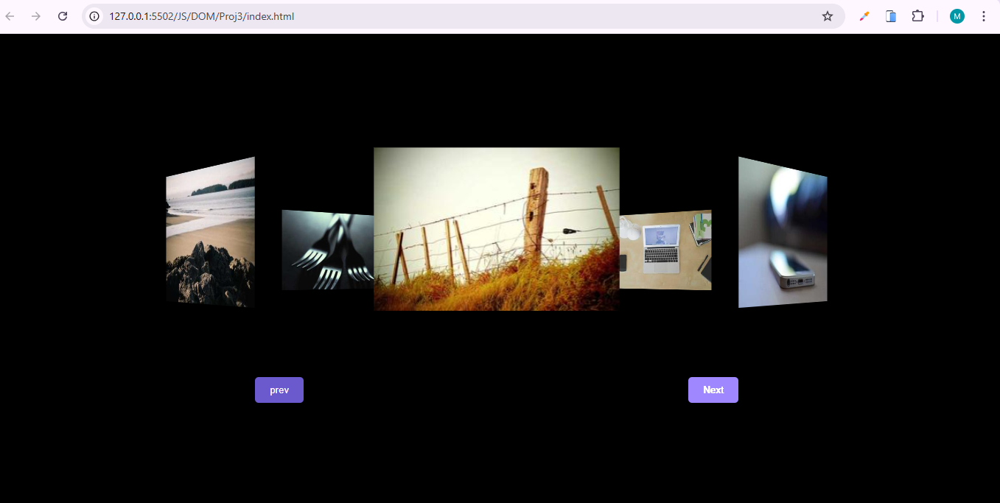

# Rotating Image Gallery

A visually engaging rotating image gallery built with HTML, CSS, and JavaScript.

## Features

- Smooth rotation of images in a circular layout
- Responsive design for various screen sizes
- Easy navigation with Next/Previous controls

## Getting Started

1. **Clone or download** this repository to your local machine.
2. Open `index.html` in your preferred web browser.

## Preview

## License

This project is provided for educational purposes.